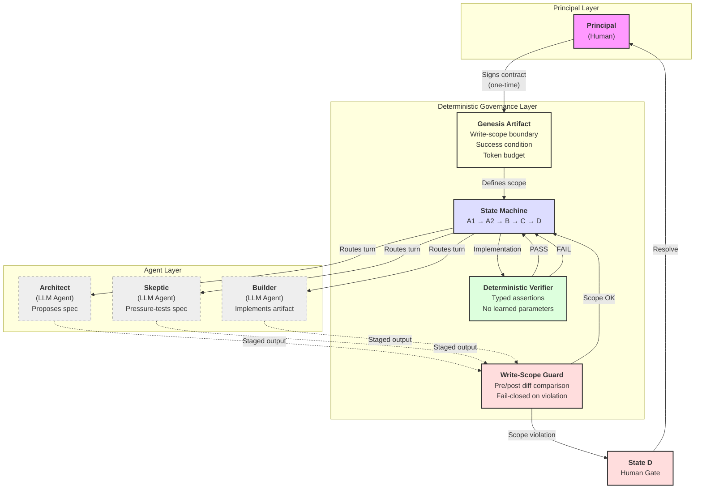

# Figure 1 — M-Form Architecture

Caption: Deterministic governance separates generation from evaluation in the M-Form architecture. Solid lines are deterministic enforcement boundaries; dashed lines are probabilistic agent outputs. The principal interacts only at genesis (contract signing) and State D (human gates). All intermediate governance is deterministic Python with no learned parameters.

## Mermaid source

## Text description (for manuscript)

The system has three layers:

1. **Principal Layer.** The human signs a genesis artifact (an immutable contract specifying write-scope boundary, success condition, and token budget) and resolves human gates at State D. The principal does not participate in intermediate states.

2. **Deterministic Governance Layer.** Four components with no learned parameters:
   - *State machine* routes turns between agents (A1 → A2 → B → C → D)
   - *Write-scope guard* computes a repository diff before and after each agent invocation; any unauthorized modification triggers a fail-closed transition to State D
   - *Deterministic verifier* checks typed assertions (contains_phrase, contains_citation, has_subsection, absent_phrase) against the implementation artifact; PASS advances the state, FAIL returns to the builder
   - *Genesis artifact* defines the enforcement floor before execution begins

3. **Agent Layer.** Language model agents (Architect, Skeptic, Builder) operate within contracted scope. Their outputs are probabilistic. They cannot modify the governance layer, access files outside their read bundle, or advance their own state. All agent output passes through the write-scope guard before the state machine accepts it.

The enforcement boundary between layers 2 and 3 is the paper's central structural claim: it is deterministic, fail-closed, and cannot be softened by model output.
